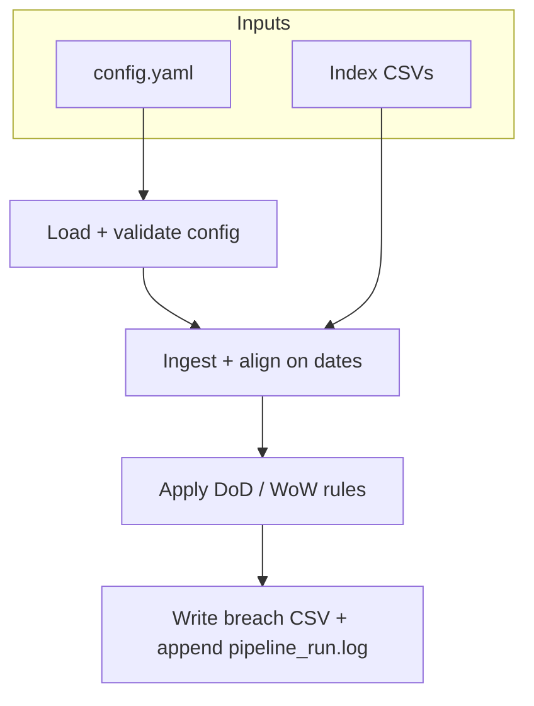

# Pass/Fail Check Pipeline

Historical US index CSVs are ingested, aligned on dates, and checked for large day-over-day (DoD) and week-over-week (WoW) moves. Breaches are written to `output/threshold_breaks.csv`. Thresholds and which checks run are controlled by `config.yaml`.

## Pipeline flow

End-to-end path (orchestrated in `main.py`; stages live under `pipeline/`):



Same flow in plain text:

```text
config.yaml  --->  validate  --->  ingest + align  --->  process (DoD/WoW)  --->  CSV + pipeline_run.log
                         ^                ^
                         |            index CSVs
```

## Assumptions / explanations

For week-over-week, the definition is **five trading rows back** on the aligned calendar, not “same weekday last calendar week.”

Dates are **aligned** across files (inner join on `observation_date`) so each row has a close for every configured ticker. That keeps comparisons consistent when all series share the same calendar context and leaves room for cross-ticker logic later. The pipeline requires those observed dates to stay aligned.

## Setup

**Python:** use **3.10 or newer** (3.12 is fine). Dependencies in `requirements.txt` are pinned so another machine gets the same library versions.

Use a virtual environment (recommended; avoids PEP 668 “externally managed” errors on macOS):

```bash
cd /path/to/Pass:fail_check_pipeline
python3 -m venv /tmp/pass_fail_pipeline_venv
/tmp/pass_fail_pipeline_venv/bin/pip install -r requirements.txt
```

If the project path contains a colon (`:`), creating `.venv` inside the repo may fail; use a venv path outside the repo as above.

## Run

```bash
/tmp/pass_fail_pipeline_venv/bin/python main.py
```

Data directory (defaults to `./data`):

```bash
/tmp/pass_fail_pipeline_venv/bin/python main.py --data-dir /path/to/csv_folder
# backward-compatible positional:
/tmp/pass_fail_pipeline_venv/bin/python main.py /path/to/csv_folder
```

Other flags (see `python main.py --help`): `--config`, `--output-dir`, `--csv-path`, `--log-path`. `--output-dir` and `--csv-path` are mutually exclusive.

**Exit codes** (for CI and scripts): `0` = success, `1` = reject or unexpected error, `2` = warning (e.g. extreme volatility).

Output: by default `output/threshold_breaks.csv` and append-only `output/pipeline_run.log` ([`pipeline/output.py`](pipeline/output.py)). Override paths with `--output-dir`, `--csv-path`, or `--log-path`.

## Configuration (`config.yaml`)

After load, the file is validated (`pipeline/config_validate.py`): required non-empty `tickers`, numeric thresholds in `(0, 1]`, only known top-level keys, and `checks` limited to `DoD` / `WoW` with boolean values. Invalid config returns `REJECT: Invalid config: …` without running ingestion.

- `tickers`: which `{TICKER}.csv` files to load from the data folder.
- `thresholds`: optional per-ticker DoD threshold (decimal, e.g. `0.015` for 1.5%). Others use `default_threshold_dod` (default 1%).
- `thresholds_wow`: optional per-ticker WoW threshold (decimal). Others use `default_threshold_wow` (default 5%).
- `default_threshold_wow`: default WoW threshold when a ticker is not listed under `thresholds_wow`.
- `checks`: `DoD` / `WoW` booleans to turn each check on or off.
- `anomaly_warning_limit`: if any DoD move exceeds this magnitude, the pipeline returns `WARNING: Extreme Volatility` and the CLI exits with code `2` (see `main.py`).

Missing config file (wrong `--config` path): `REJECT: Config not found`. Missing ticker CSV under `--data-dir`: `REJECT: Missing Files`.

## Static YAML vs database configuration

This project uses **YAML** next to the code: thresholds and check toggles are **versioned in git**, reviewable in PRs, and need no database or credentials for a batch run. A **database** (or config service) fits better when thresholds are **per-tenant**, edited through a **product UI**, change **often without a deploy**, or must be queried by many services at runtime. For a scheduled index check like this take-home, static config is the simpler and more reproducible fit.

## Tests

```bash
/tmp/pass_fail_pipeline_venv/bin/python -m unittest tests.test_suite -v
```

## Disclosure

Coding assistants, specifically Cursor and Gemini, were used in this project (debugging, tests, README, and parts of the implementation). See also the disclosure note in `main.py`.
